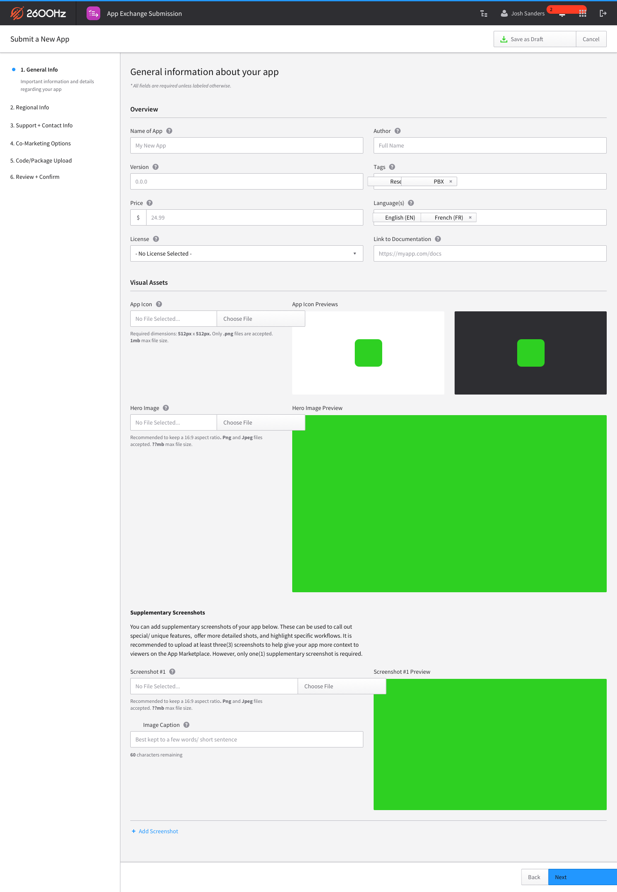
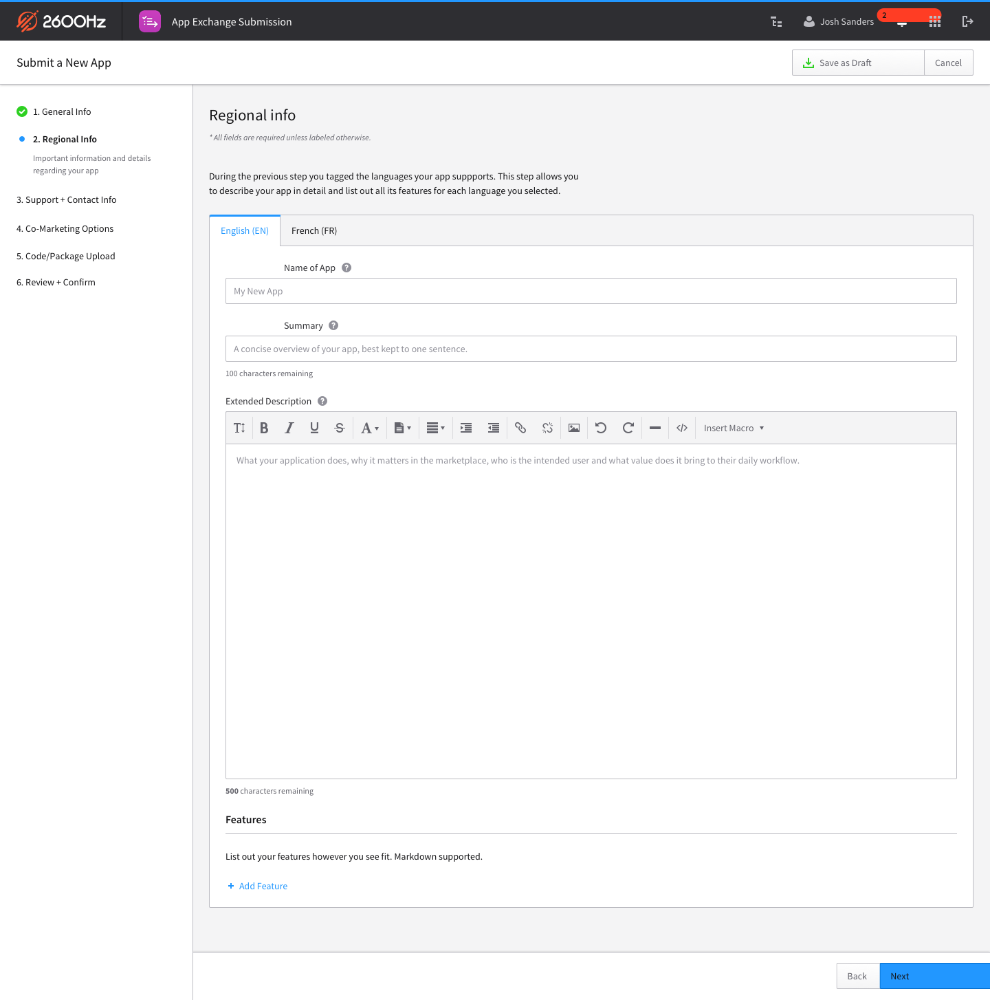
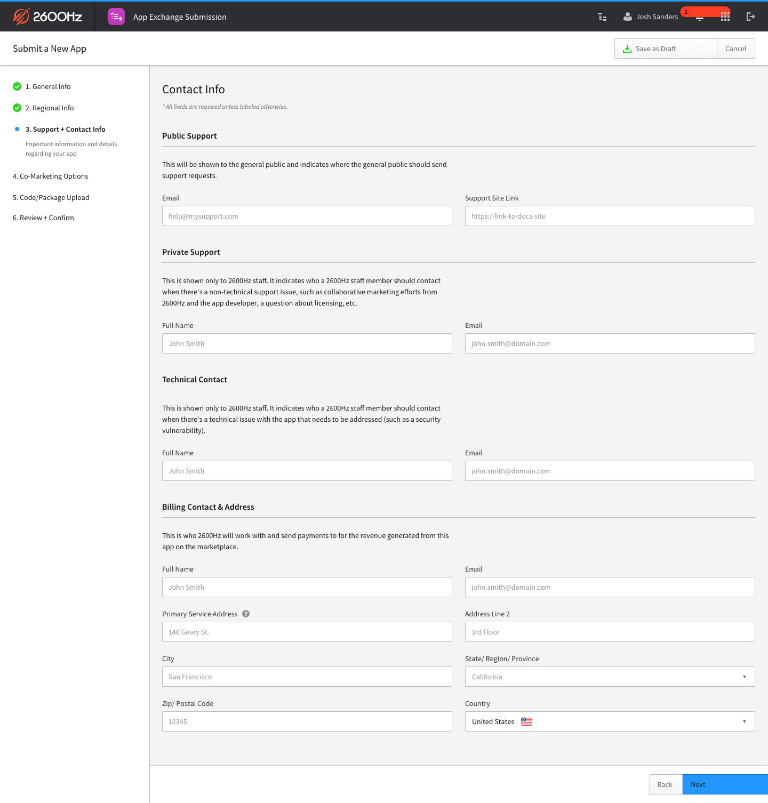
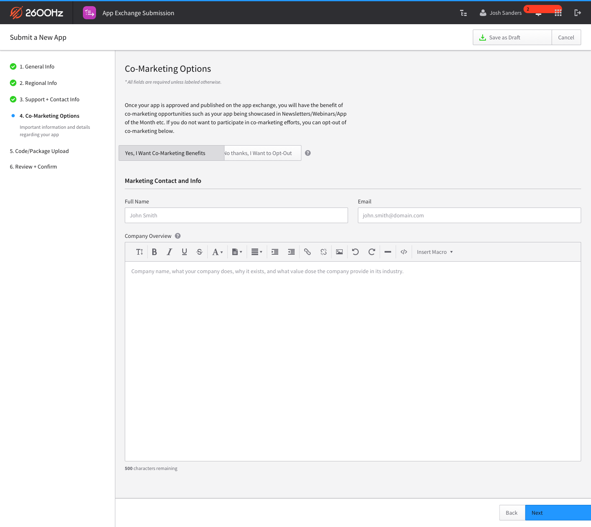
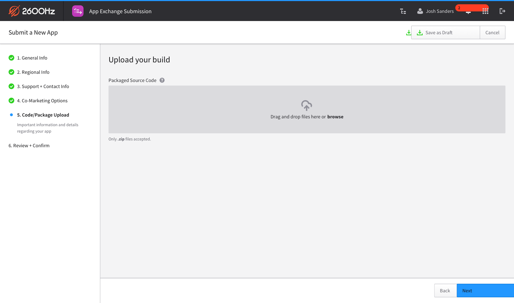
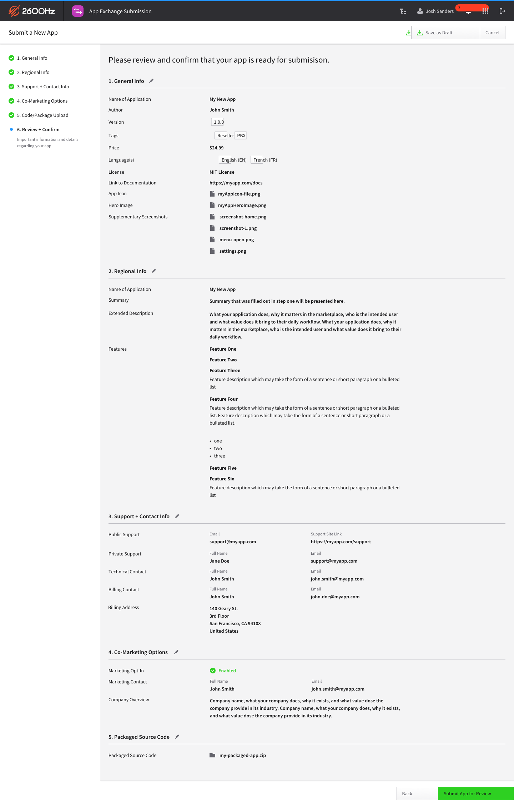
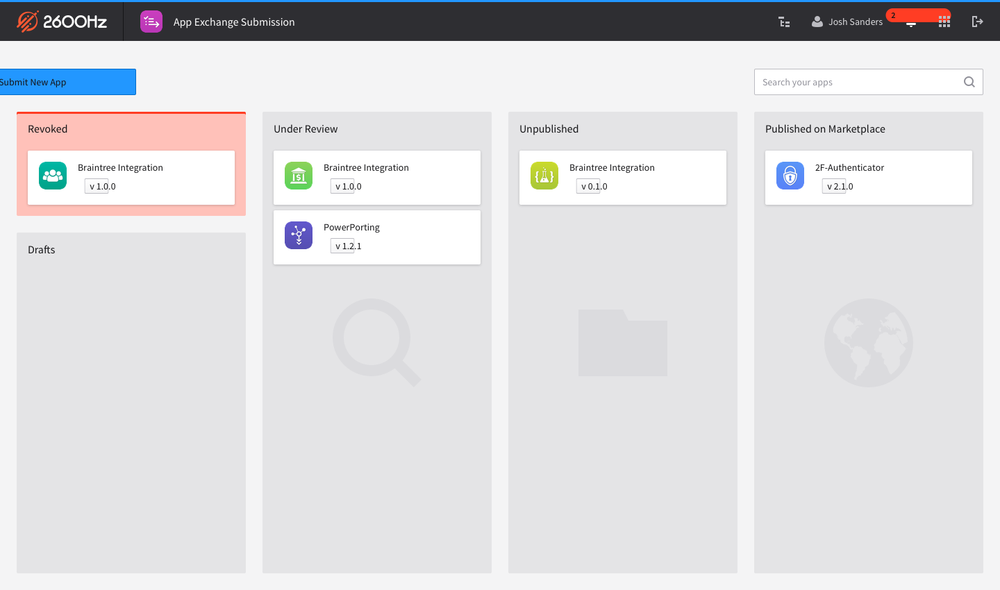

# App Exchange 2019

## Submission Process

### General Information

Fill out general information about the application you are submitting:

### Internalization

If your application targets more than one language, you can configure that information in the languages supported.

### Contact Information

Submit information about how to contact you for support, technical questions, and billing information.

### Co-marketing Opportunities

Opt-in to allow your app to be shared in newsletters, webinars, and other promotional materials from 2600Hz.

### Upload the source

Upload the payload containing your app:

#### UI

Javascript applications that live within the [MonsterUI framework](https://github.com/2600hz/monster-ui). Generally speaking, these applications will talk to the KAZOO APIs or other external HTTP APIs.

#### Backend

Erlang applications (for now) that will run on a KAZOO cluster. These may be backend only, expose new HTTP APIs via Crossbar modules, or some combination.

### Review

Review the details of the application submission before entering the approval process

### Approval process

There are 4 stages to being published in the marketplace:

1. Drafts - where initial submissions go before they're reviewed and confirmed
2. Under Review - 2600Hz will review the submitted source and ensure it is able to be integrated into the marketplace and KAZOO infrastructure.
3. Unpublished - Approved by 2600Hz and waiting for publishing
4. Published - In the marketplace and available in search and for purchase/installation by customers.

# What makes a good app?

## Pricing model

- One-time charge
- Subscription
- Free

### In-app purchases

- The downloaded app must be useful without any additional purchases.
- All fees, subscriptions, recurring charges, etc, must be explicitly stated
- No advertising allowed

## Supporting your customers

- Provide an email and/or phone number for customers to call for support
- Provide a forum

2600Hz will not support or answer customer questions about 3rd party applications.

## Well tested

Depending on the application, various testing should be performed:

- Test against small and large (10,000s of records like CDRs) datasets
- No conflicts with other packages
  - No module clashing in Erlang
  - No interference with other apps' settings
- Does it work in federated (multi-zone) environments?
- Hosted vs private cloud vs own infrastructure limits?
- Does it respect KAZOO's whitelabel system?

## Well documented

- Any additional ports / services required on the backend
- Tutorial or beginner's guide to using your app
- Any caveats or known issues
- All external services contacted (if any)

# Exicted to see what you make
